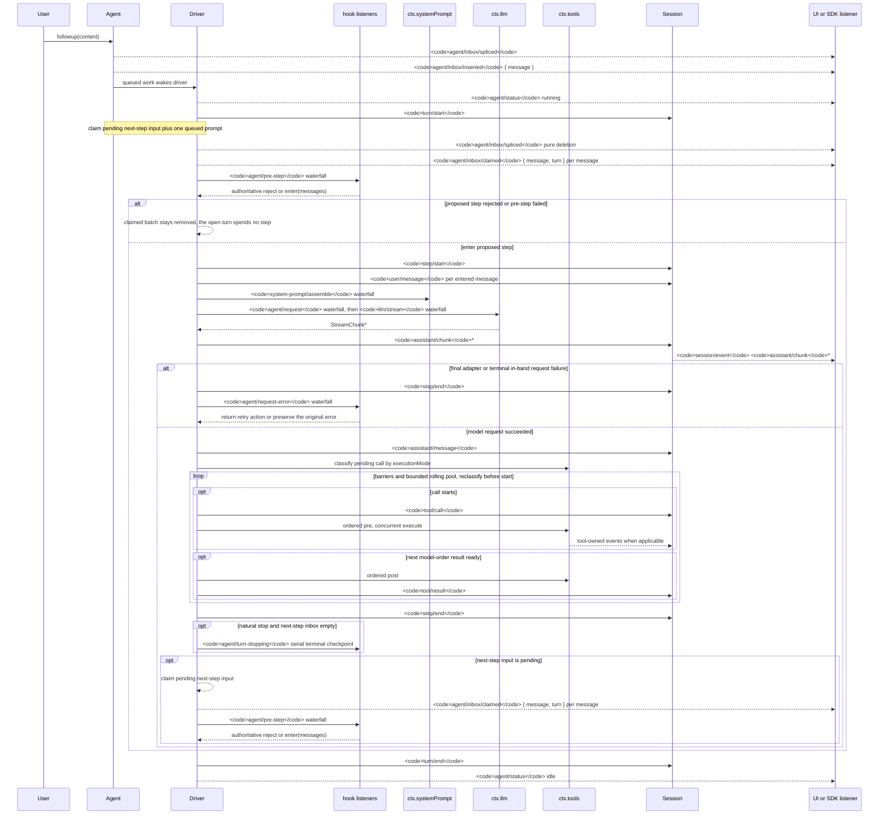

<!-- Generated by scripts/gen-doc-graphs.ts - do not edit by hand.
     Run `pnpm run gen-doc-graphs` to regenerate. -->

# Agent ターンとステップのライフサイクル

このシーケンスは、[architecture.md](architecture.md#turn-flow)を視覚的に補完するものです。永続的な再生情報は`session/event`に、ライブの制御とステータスは`agent/*`に保持されます。

`assistant/message`イベントは、コンテンツがない場合や`max-tokens`による終了を含め、成功したすべてのプロバイダー呼び出しを記録します。空のコンテンツは派生履歴に含まれませんが、永続イベントは使用状況と`sourceEventSeqs`を保持し、明示的な空リストを含めて正確な`assistant/chunk`イベントを列挙します。

`dsh-compaction-basic`は、リクエスト導出前の負荷には`agent/pre-step`を使用し、正規のコンテキスト超過には`agent/request-error`のみを使用します。いずれかのトリガーが条件を満たすと、要約の選択前に任意のツール結果の枝刈りが実行されます。リカバリーは、クローズされた失敗ステップと失敗ターンのクローズの間で機能し、枝刈りまたは要約によってサーフェス置換世代が進んだ場合にのみ、新しい再試行ターンを開始します。それ以外の場合は、元のリクエストエラーが引き続き優先されます。

返された`agent/pre-step`の決定が優先されます。`next()`をラップするリスナーは、置換が意図された場合を除き、下流メッセージを保持します。ステアリングと注入されたコンテキストは、後続のクレーム操作が次ステップのバッチを取得した後、同じウォーターフォールを通過します。

再生可能なトランスクリプトデータが必要な SDK ユーザーは`session/event`を使用してください。`agent/*`は、キューとステータス、プロンプトのインターセプト、リクエスト構築、ステアリング、継続、エラーのためのライブ協調 API です。

メンテナンスモード: 厳選された Mermaid シーケンスです。正確なイベントシグネチャは、生成された Cordis カタログにあります。
