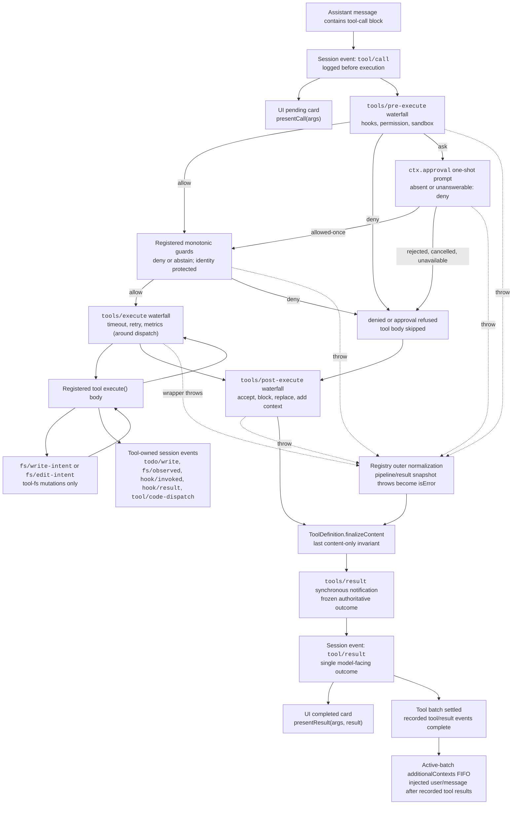

<!-- Generated by scripts/gen-doc-graphs.ts - do not edit by hand.
     Run `pnpm run gen-doc-graphs` to regenerate. -->

# ツール実行パイプライン

このグラフは、ループを変更せずに、ポリシー、フック、サンドボックス化、ファイルシステムガード、結果の書き換え、最終結果の監視、および UI レンダリングがどこで実行されるかを示します。`tools/pre-execute` のウォーターフォールが最初に実行され、次に単調ガードが実行され、その後に `tools/execute` と `tools/post-execute` のウォーターフォールが続きます。3 つのウォーターフォールは呼び出しを変換できます。定義が所有する `finalizeContent` と `tools/result` はその後に実行されます。

ファイルシステムの編集前読み取りチェックは、`fs/*` イベントでは `tool-fs` の下に配置されます。汎用の事前・事後ウォーターフォールはフックと承認ポリシーをホストします。`ctx.approval` は単調ガードより前に要求を解決し、並べ替えてはならない所有者ポリシーは登録済みガードとして残ります。タイムアウトなどのディスパッチ前後の関心事は `tools/execute` をラップします。レジストリは候補結果を損失なくスナップショットし、可視定義のスナップショット済み `finalizeContent` コールバックが同期的なコンテンツ専用の不変条件を適用する前に、スナップショット失敗を正規化します。次に `tools/result` が、不変かつ損失のない JSON の結果を監視します。これにより、フックはツールを 1 つのポリシーサービスに結合せずに、ツールファミリー全体にまたがることができます。Code Mode は、予約済みの `run_code` トランスポートとシリアル化されたサブ呼び出しの両方をパイプラインに送ります。サブ呼び出しは親トークンを保持し、`tool/code-dispatch` をログに記録し、拒否を拘束力のあるリジェクションとして返し、呼び出しと結果の隣接性を保つために `additionalContexts` を省略します。

メンテナンスモード: 厳選された Mermaid フローです。正確なツールスキーマとイベントシグネチャは、生成されたカタログにあります。
