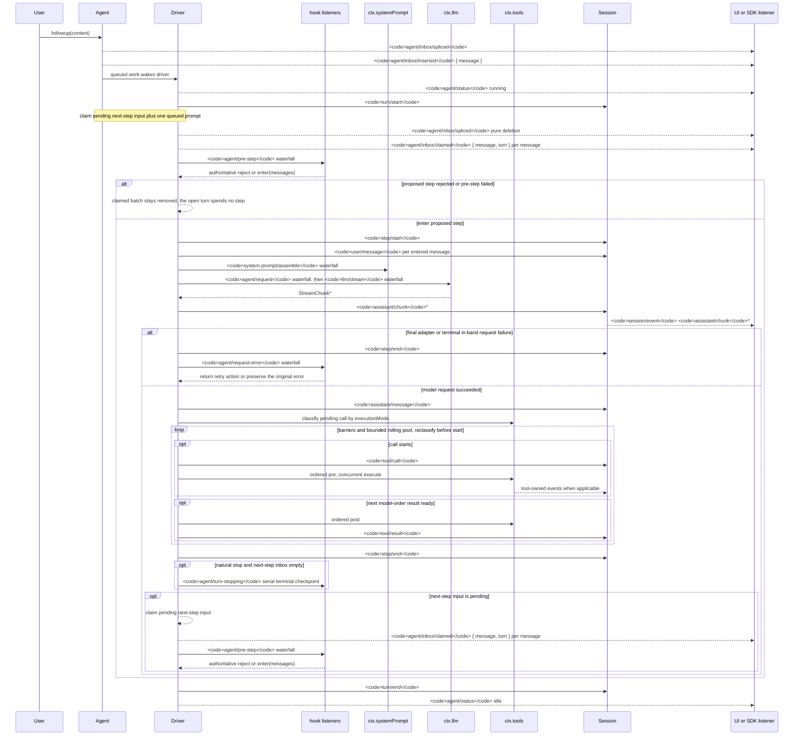

<!-- Generated by scripts/gen-doc-graphs.ts - do not edit by hand.
     Run `pnpm run gen-doc-graphs` to regenerate. -->

# Agent Turn 및 Step 수명 주기

이 시퀀스는 [architecture.md](architecture.md#turn-flow)의 시각적 보조 자료입니다. 내구성 있는 재생 사실은 `session/event`에, 실시간 제어/상태는 `agent/*`에 유지합니다.

`assistant/message` 이벤트는 콘텐츠가 없는 완료와 `max-tokens` 완료를 포함하여, 성공한 모든 provider 호출을 기록합니다. 빈 콘텐츠는 파생 이력에서 제외되지만, 내구성 있는 이벤트는 명시적인 빈 목록을 포함해 정확한 `assistant/chunk` 이벤트를 나열하는 `sourceEventSeqs`와 사용량을 유지합니다.

`dsh-compaction-basic`은 요청 파생 전에 압박 상태를 위해 `agent/pre-step`을 사용하고, 표준 컨텍스트 오버플로에만 `agent/request-error`을 사용합니다. 두 트리거 중 하나가 충족되면 요약 선택 전에 선택적 도구 결과 정리가 실행됩니다. 복구는 종료된 실패 Step과 실패 Turn 종료 사이에서 작동하며, 정리 또는 요약이 표면 교체 세대를 진행시킬 때에만 새 재시도 Turn을 엽니다. 그렇지 않으면 원래 요청 오류가 계속 권한을 갖습니다.

반환된 `agent/pre-step` 결정이 권한을 가지며, `next()`을 감싸는 리스너는 교체가 의도된 경우가 아니면 후속 메시지를 보존합니다. 조정 및 주입된 컨텍스트는 이후의 claim 작업이 다음 Step 배치를 가져간 후에도 동일한 폭포 흐름을 거칩니다.

재생 가능한 트랜스크립트 데이터가 필요한 SDK 사용자는 `session/event`을 사용해야 합니다. `agent/*`은 큐/상태, 프롬프트 가로채기, 요청 구성, 조정, 계속 및 오류를 위한 실시간 조정 API입니다.

유지 관리 모드: 선별된 Mermaid 시퀀스이며, 정확한 이벤트 시그니처는 생성된 Cordis 카탈로그에 있습니다.
