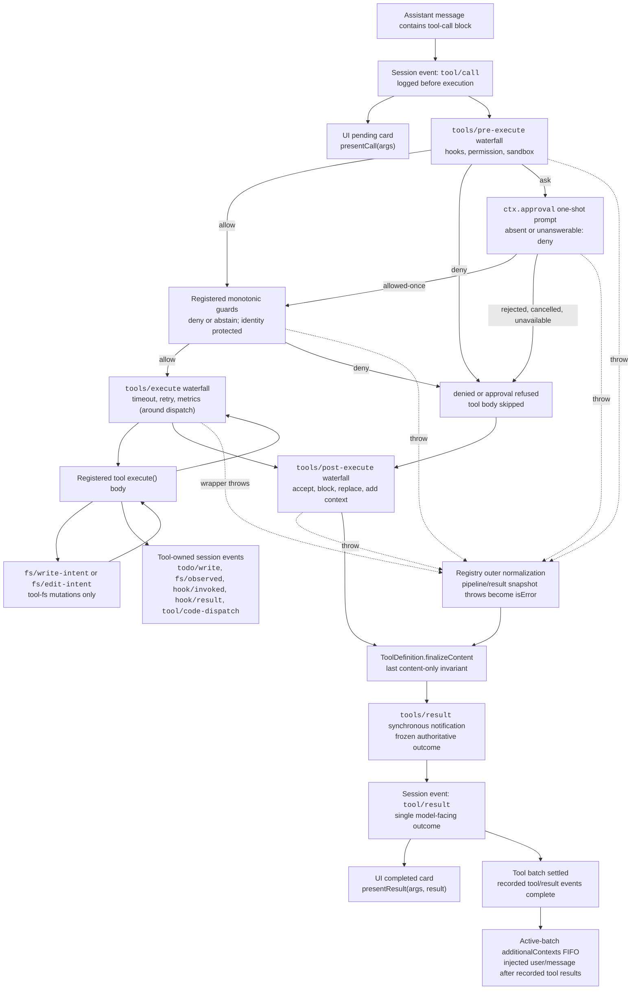

<!-- Generated by scripts/gen-doc-graphs.ts - do not edit by hand.
     Run `pnpm run gen-doc-graphs` to regenerate. -->

# 도구 실행 파이프라인

이 그래프는 루프를 변경하지 않으면서 정책, 훅, 샌드박싱, 파일 시스템 가드, 결과 재작성, 최종 결과 관찰 및 UI 렌더링이 실행되는 위치를 보여 줍니다. `tools/pre-execute` 폭포가 먼저 실행되고 단조 가드가 다음에 실행되며, 이어서 `tools/execute` 및 `tools/post-execute` 폭포가 실행됩니다. 세 폭포 모두 호출을 변환할 수 있습니다. 정의 소유의 `finalizeContent` 및 `tools/result`는 그 후에 실행됩니다.

파일 시스템 편집 전 읽기 검사는 `fs/*` 이벤트에서 `tool-fs` 아래에 유지됩니다. 일반 사전/사후 폭포는 훅과 승인 정책을 호스팅합니다. `ctx.approval`는 단조 가드 전에 요청을 해결하며, 재정렬하면 안 되는 소유자 정책은 등록된 가드로 유지됩니다. 시간 초과와 같은 디스패치 주변 관심사는 `tools/execute`를 감쌉니다. 레지스트리는 후보 결과의 무손실 스냅샷을 만들고, 표시되는 정의의 스냅샷된 `finalizeContent` 콜백이 동기식 콘텐츠 전용 불변 조건을 적용하기 전에 스냅샷 실패를 정규화합니다. এরপর `tools/result`가 불변의 무손실 JSON 결과를 관찰합니다. 이를 통해 훅은 도구를 하나의 정책 서비스에 결합하지 않고도 도구 계열 전반에 걸쳐 적용될 수 있습니다. 코드 모드는 예약된 `run_code` 전송과 직렬화된 하위 호출을 모두 파이프라인을 통해 전송합니다. 하위 호출은 부모 토큰을 전달하고 `tool/code-dispatch`를 기록하며, 거부를 구속력 있는 거절로 반환하고 호출/결과 인접성을 유지하기 위해 `additionalContexts`를 생략합니다.

유지 관리 모드: 선별된 Mermaid 흐름입니다. 정확한 도구 스키마와 이벤트 시그니처는 생성된 카탈로그에 있습니다.
